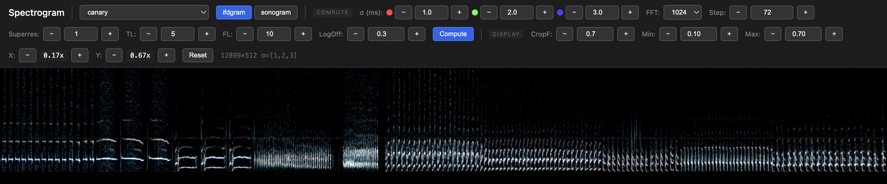

# Interactive Reassigned Spectrogram Viewer

A Python-based tool for computing and visualizing reassigned spectrograms with an interactive WebGL viewer. Based on the algorithm described in Gardner & Magnasco, PNAS 2006.


*Interactive spectrogram viewer showing combined view with zeros overlay.*

## What is a Reassigned Spectrogram?

Standard spectrograms suffer from a tradeoff between time and frequency resolution. Reassigned spectrograms (also called "remapped sonograms") use phase information to reassign energy to more precise time-frequency coordinates. The fundamental tradeoff remains, but for sparse signals — where individual components are well-separated — reassignment can dramatically improve localization precision.
This visualizer computes the spectrogram at multiple timescales (sigma values). In the **ifdgram** view, three timescales are displayed as RGB channels, allowing you to see which features are consistent across scales. The **combined** view overlays zero-crossing contours on the reassigned spectrogram, highlighting the spectral structure.

## Installation

1. Create and activate a virtual environment:
   ```bash
   python3 -m venv venv
   source venv/bin/activate
   ```

2. Install dependencies:
   ```bash
   pip install -r requirements.txt
   ```

## Files

- **ifdv.py** - Core algorithm for computing reassigned spectrograms
- **server.py** - Flask server for interactive viewing with on-demand computation
- **viewer.html** - WebGL-based viewer with max-pooling for large images
- **requirements.txt** - Python dependencies

## Usage

### Interactive Viewer (Recommended)

Start the Flask server from the specviewer directory:
```bash
cd specviewer              # navigate to the project folder
source venv/bin/activate   # activate virtual environment
python server.py           # start server
```

Open http://localhost:8000 in your browser.

**Note:** Place your WAV files in the same directory as `server.py`, and run `python server.py` from that directory. The server automatically detects all `.wav` files in its folder.

**Controls:**

*Compute Parameters (require recomputation via Compute button):*
- **WAV selector** - Choose which audio file to analyze (parameters reset to defaults when switching)
- **View mode** - Toggle between ifdgram, sonogram, zeros, combined, and crossings views
- **σ (ms)** - Three sigma values for R, G, B channels
- **FFT** - FFT window size (256, 512, 1024, 2048, 4096)
- **Step** - Samples between windows (smaller = higher time resolution)
- **Superres** - Frequency superresolution factor (1-10)
- **TL** - Temporal locking window (stray point removal in time)
- **FL** - Frequency locking window (stray point removal in frequency)
- **LogOff** - Log scale offset for `log(amp + offset)` contrast

*Display Parameters (real-time WebGL, no recomputation needed):*
- **CropF** - Frequency crop factor (0.1-1.0, show low frequencies)
- **Min/Max** - Intensity thresholds for display contrast (ifdgram, sonogram, zeros views)
- **Zeros Min/Max, IFD Min/Max** - Separate thresholds for zeros overlay and ifdgram in combined view
- **X/Y zoom** - Independent time and frequency zoom

*Navigation:*
- **Mouse drag** - Pan along time axis
- **Mouse wheel** - Zoom time axis at cursor position
- **W/S keys** - Frequency (Y) zoom in/out
- **A/D keys** - Time (X) zoom in/out
- **R key** - Reset view to fit image

*Audio Playback:*
- **Play** - Play the audio for the currently visible time range
- **Stop** - Stop audio playback

**Caching:** Computed spectrograms are cached on the server. Switching between files or toggling ifdgram/sonogram with the same parameters is instant after the first computation.

## Parameters

### Sigma (σ)
The temporal resolution in milliseconds. Controls the time-frequency tradeoff:
- **Small σ (0.5-1ms)** - Better time resolution, sees clicks and transients
- **Large σ (3-5ms)** - Better frequency resolution, sees tonal content
- **Intermediate** - Usually best for most signals

The RGB display shows three sigmas simultaneously:
- **Red** - First sigma value (typically smallest)
- **Green** - Second sigma value
- **Blue** - Third sigma value (typically largest)

White/gray regions indicate features present at all timescales.

### FFT Size
The FFT window size controls the frequency resolution:
- **Smaller (256, 512)** - Better time resolution, coarser frequency bins
- **Larger (2048, 4096)** - Better frequency resolution, smoother in time

### Step Size
The number of samples between successive windows (default: 4). `overlap = fft_size - step_size`.
- **Smaller step** - More overlap, sharper lines, but wider images and slower computation
- **Larger step** - Less overlap, faster computation, narrower images

### Superresolution
Frequency superresolution factor (1-10). Increases the number of frequency bins in the output by interpolating during the reassignment process. Higher values show more frequency detail but increase computation time.

### Locking Windows (TL, FL)
Control the removal of "stray points" in the reassigned spectrogram:
- **TL (Temporal Locking)** - Maximum allowed displacement in time (default: 5)
- **FL (Frequency Locking)** - Maximum allowed displacement in frequency (default: 5)
- **Smaller values** - Sharper lines but may introduce gaps
- **Larger values** - Preserves more signal but may be noisier

### CropF (Frequency Crop)
Controls what fraction of the frequency spectrum to display (0.1-1.0):
- **0.7** (default) - Show bottom 70% of frequency range
- **1.0** - Show full frequency spectrum
- **0.5** - Show bottom half (lower frequencies)

This is a real-time WebGL control - adjust instantly without recomputing.

### Min/Max (Intensity Thresholds)
Real-time display controls for adjusting contrast:
- **Min** (default 0.00) - Values below this threshold become black
- **Max** (default 0.10) - Values above this threshold become maximum intensity

Colors are rescaled between these thresholds, allowing interactive adjustment of dynamic range without recomputing the spectrogram.

In **combined view**, separate thresholds are provided for the zeros overlay (Zeros Min/Max) and the ifdgram background (IFD Min/Max).

### LogOff (Log Offset)
Controls the offset in the log scale transformation `log(amp + offset)`:
- **Lower values (0.01-0.1)** - More contrast for weak signals
- **Higher values (0.5-1.0)** - Compressed dynamic range
- Default: 0.3

## WebGL Max-Pooling

The viewer uses a WebGL shader that performs max-pooling when zoomed out. This means when multiple spectrogram pixels are combined into one screen pixel, the brightest value is shown rather than the average. This preserves signal peaks that might otherwise be diluted.

## Limitations

- WebGL has a maximum texture size (typically 16384 pixels). Very long recordings are automatically truncated to fit within this limit based on the step size.
- The interactive viewer requires a local server due to browser security restrictions on loading local files into WebGL.

## References

- Gardner, T. J., & Magnasco, M. O. (2006). Sparse time-frequency representations. *Proceedings of the National Academy of Sciences*, 103(16), 6094-6099.
