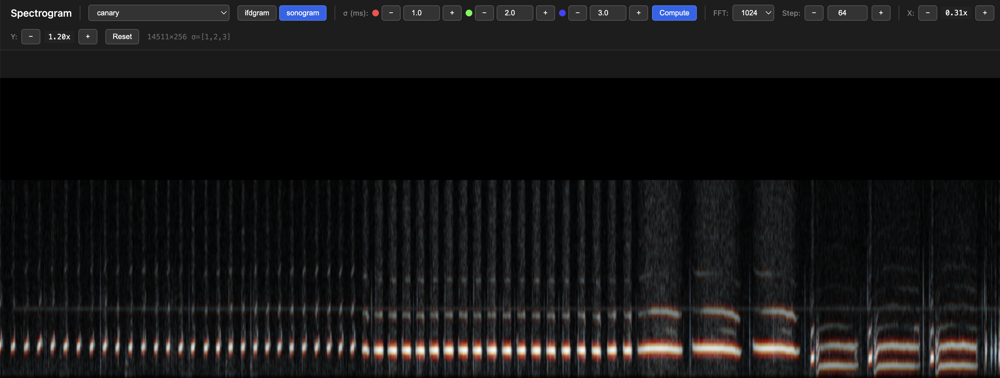
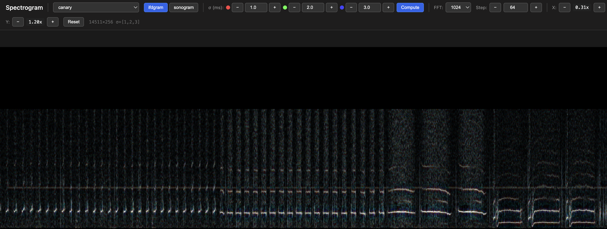

# IFDV - Interactive Reassigned Spectrogram Viewer

A Python-based tool for computing and visualizing reassigned spectrograms (ifdgrams) with an interactive WebGL viewer. Based on the algorithm described in Gardner & Magnasco, PNAS 2006.


*Multi-timescale spectrogram of canary song.*


*Reassigned spectrogram (ifdgram) of the same canary song. RGB channels represent σ = 1ms (red), 2ms (green), 3ms (blue).*

## What is a Reassigned Spectrogram?

Standard spectrograms suffer from a tradeoff between time and frequency resolution. Reassigned spectrograms (also called "remapped sonograms" or "ifdgrams") use the phase information to sharpen the representation, producing cleaner spectral lines without sacrificing resolution.

The key insight is computing the spectrogram at multiple timescales (sigma values) and combining them. This implementation displays three timescales as RGB channels, allowing you to see which features are consistent across scales.

## Installation

1. Create and activate a virtual environment:
   ```bash
   python3 -m venv venv
   source venv/bin/activate
   ```

2. Install dependencies:
   ```bash
   pip install numpy scipy matplotlib pillow flask
   ```

## Files

- **ifdv.py** - Core algorithm for computing reassigned spectrograms
- **process_wavs.py** - Batch processing script to generate PNG images from WAV files
- **server.py** - Flask server for interactive viewing with on-demand computation
- **viewer.html** - WebGL-based viewer with max-pooling for large images

## Usage

### Interactive Viewer (Recommended)

Start the Flask server:
```bash
source venv/bin/activate
python server.py
```

Open http://localhost:8000 in your browser.

**Controls:**
- **WAV selector** - Choose which audio file to analyze (parameters reset to defaults when switching)
- **ifdgram/sonogram** - Toggle between reassigned and standard spectrogram
- **σ (ms)** - Three sigma values for R, G, B channels (use +/- buttons or type values)
- **FFT** - FFT window size (256, 512, 1024, 2048, 4096)
- **Step** - Samples between windows (smaller = more overlap = higher time resolution but wider images)
- **Compute** - Recompute with current settings (or press Enter)
- **X/Y zoom** - Independent time and frequency zoom
- **Mouse drag** - Pan around the image
- **Mouse wheel** - Zoom both axes at cursor position
- **W/S keys** - Frequency (Y) zoom in/out
- **A/D keys** - Time (X) zoom in/out
- **R key** - Reset view to fit image

**Caching:** Computed spectrograms are cached on the server. Switching between files or toggling ifdgram/sonogram with the same parameters is instant after the first computation.

### Batch Processing

To generate static PNG images for all WAV files in the directory:
```bash
source venv/bin/activate
python process_wavs.py
```

This creates `*_ifdgram.png` and `*_sonogram.png` files for each WAV file.

## Parameters

### Sigma (σ)
The temporal resolution in milliseconds. Controls the time-frequency tradeoff:
- **Small σ (0.5-1ms)** - Better time resolution, sees clicks and transients
- **Large σ (3-5ms)** - Better frequency resolution, sees tonal content
- **Intermediate** - Usually best for most signals

The RGB display shows three sigmas simultaneously:
- **Red** - First sigma value (typically smallest)
- **Green** - Second sigma value
- **Blue** - Third sigma value (typically largest)

White/gray regions indicate features present at all timescales.

### FFT Size
The FFT window size controls the frequency resolution:
- **Smaller (256, 512)** - Better time resolution, coarser frequency bins
- **Larger (2048, 4096)** - Better frequency resolution, smoother in time

### Step Size
The number of samples between successive windows. `overlap = fft_size - step_size`.
- **Smaller step** - More overlap, sharper lines, but wider images and slower computation
- **Larger step** - Less overlap, faster computation, narrower images

### Other Parameters (in code)
- **tl, fl** - Temporal and frequency locking windows (controls stray point removal)
- **zoom_f** - Frequency zoom factor in output

## WebGL Max-Pooling

The viewer uses a WebGL shader that performs max-pooling when zoomed out. This means when multiple spectrogram pixels are combined into one screen pixel, the brightest value is shown rather than the average. This preserves signal peaks that might otherwise be diluted.

## Limitations

- WebGL has a maximum texture size (typically 16384 pixels). Very long recordings are automatically truncated to the first half.
- The interactive viewer requires a local server due to browser security restrictions on loading local files into WebGL.

## References

- Gardner, T. J., & Magnasco, M. O. (2006). Efficient and robust spectro-temporal analysis using sparse signal reconstruction. *PNAS*, 103(16), 6094-6099.
- Gardner, T. J., & Magnasco, M. O. (2005). Sparse time-frequency representations. *J. Acoust. Soc. Am.*, 118(3), 2095-2104.
